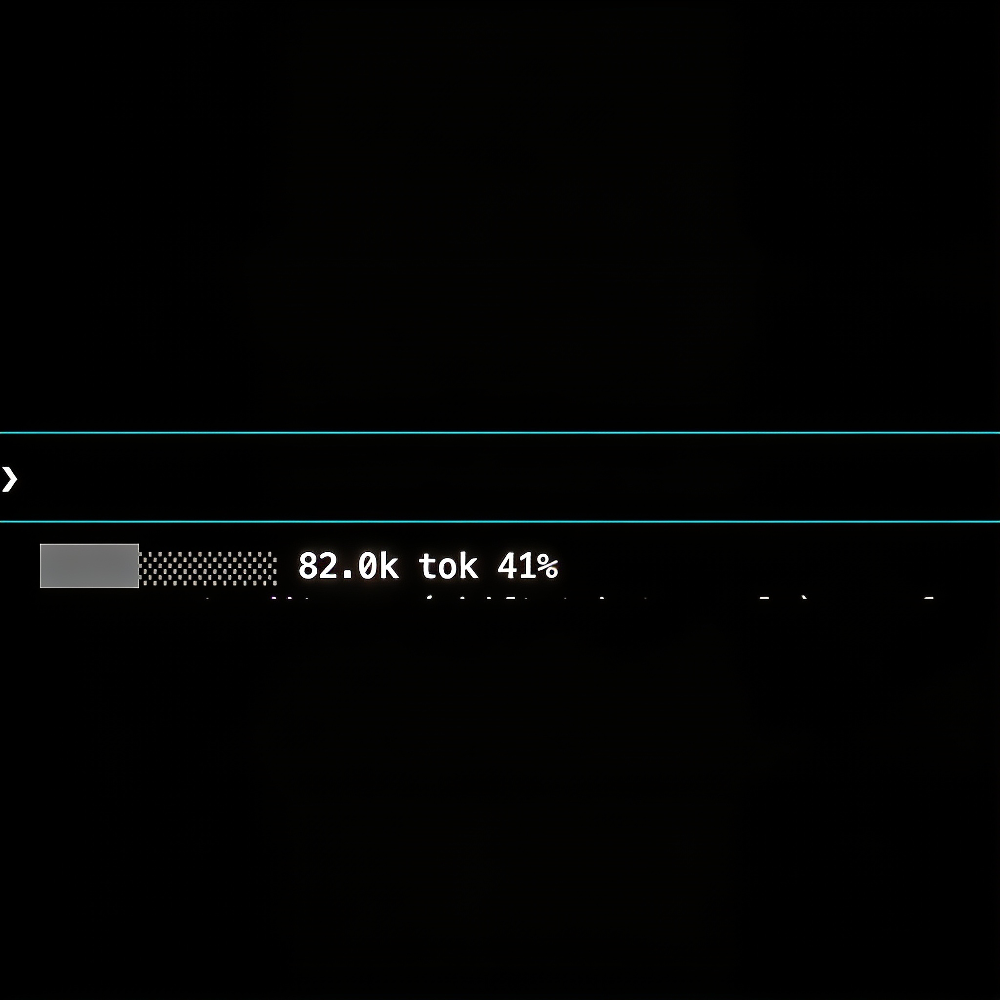

# Chyron

A [Claude Code](https://claude.com/claude-code) status line that shows how much of the model's context window you've consumed: a colored progress bar, a grouped token count, and a percentage.

```
████████░░░░ 130.000 tok 65%
```



- **Grey** ≤ 50%
- **Yellow** 51–80%
- **Red** ≥ 80%

## How it works

Claude Code passes each status line command a JSON object on stdin. The script reads live usage straight from `.context_window`:

```
.context_window.total_input_tokens / .context_window.context_window_size
```

That ratio is the percentage. Reading it from stdin means the count already reflects `/compact` and cache state — the bar drops immediately on compaction, with no transcript parsing.

(An earlier version parsed the transcript file, but Claude Code doesn't reliably flush it to the advertised path, so it read 0.)

## Requirements

- `jq`
- `awk` (built in on macOS/Linux)

## Install

One-liner (no clone) — copies the script to `~/.claude/`, `chmod +x`es it, and points `~/.claude/settings.json` at it (existing settings preserved):

```sh
curl -fsSL https://raw.githubusercontent.com/mrlemoos/chyron/main/install.sh | bash
```

Or from a clone:

```sh
./install.sh
```

Then restart Claude Code (or reload via `/statusline`).

### Homebrew

```sh
brew tap mrlemoos/chyron
brew trust mrlemoos/chyron   # Homebrew requires trusting third-party taps
brew install chyron
```

Homebrew installs the script but won't touch your Claude config. Point `~/.claude/settings.json` at the installed binary:

```json
{
  "statusLine": {
    "type": "command",
    "command": "chyron"
  }
}
```

Then restart Claude Code (or reload via `/statusline`).

### Manual

1. Copy the script somewhere stable:

   ```sh
   cp chyron.sh ~/.claude/chyron.sh
   chmod +x ~/.claude/chyron.sh
   ```

2. Point your `~/.claude/settings.json` at it:

   ```json
   {
     "statusLine": {
       "type": "command",
       "command": "bash \"/Users/YOU/.claude/chyron.sh\""
     }
   }
   ```

3. Restart Claude Code (or reload via the `/statusline` menu).

## Optional segments

The status line can prefix the bar with the model name and/or the project (current directory) name:

```
Opus 4.8  chyron  ████████░░░░ 130.000 tok 65%
```

The installer wizard asks about each one and saves your choice to `~/.claude/chyron.conf`:

```sh
show_model=1
show_project=1
```

Edit that file to toggle a segment (`0`/`1`) — no reinstall needed. You can also override per-invocation with the `--model` / `--project` flags, e.g. `chyron --model`.

## Configuration

The context window size is auto-detected from the harness stdin JSON (`.context_window.context_window_size`), so 200k vs 1M models are handled automatically. It falls back to `200000` only if the harness omits it. Colors, bar width (`width=12`), and thresholds are plain values in the `awk` block — edit to taste.

## License

MIT
